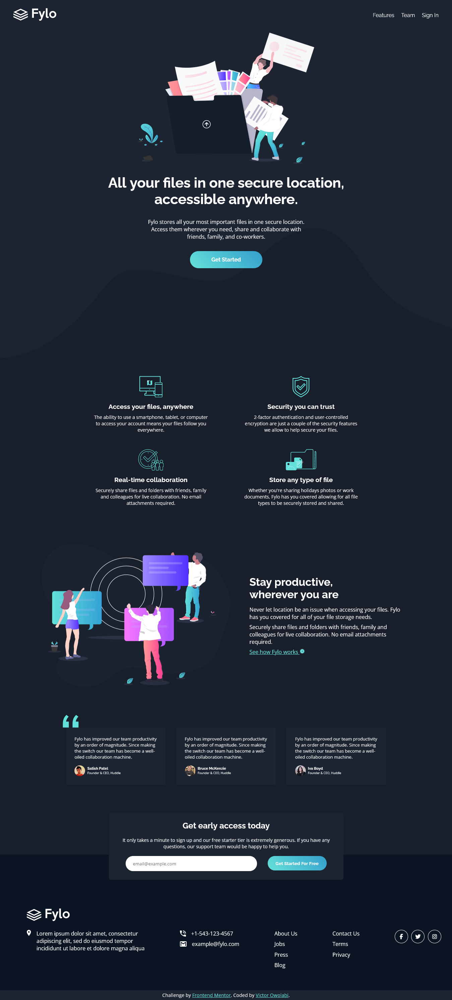

# Frontend Mentor - Fylo dark theme landing page solution

This is a solution to the [Fylo dark theme landing page challenge on Frontend Mentor](https://www.frontendmentor.io/challenges/fylo-dark-theme-landing-page-5ca5f2d21e82137ec91a50fd). Frontend Mentor challenges help you improve your coding skills by building realistic projects. 

## Table of contents

  - [The challenge](#the-challenge)
  - [Screenshot](#screenshot)
  - [Links](#links)
- [My process](#my-process)
  - [Built with](#built-with)
  - [What I learned](#what-i-learned)
  - [Continued development](#continued-development)
  - [Useful resources](#useful-resources)
- [Author](#author)
- [Acknowledgments](#acknowledgments)

### The challenge

Users should be able to:

- View the optimal layout for the site depending on their device's screen size
- See hover states for all interactive elements on the page

### Screenshot



### Links

- Solution URL: [Add solution URL here](https://your-solution-url.com)
- Live Site URL: [Add live site URL here](https://your-live-site-url.com)

## My process

### Built with

- Semantic HTML5 markup
- CSS custom properties
- Flexbox
- CSS Grid
- Mobile-first workflow
- [React](https://reactjs.org/) - JS library
- [Next.js](https://nextjs.org/) - React framework
- [Styled Components](https://styled-components.com/) - For styles

### What I learned

This was a good project that realy introduced me to the layout of a website. I loved the way I got to use css grid and flexbox  

```css
.team-card-group {
	grid-template-columns: repeat(auto-fit, minmax(18em, 1fr));
}
```
```js
let emailRegex = "^[a-zA-Z0-9._%+-]+@[a-zA-Z0-9.-]+.[a-zA-Z]{2,}$";

submitBtn.addEventListener("click", e => {
	e.preventDefault();
	if (input.value == "") {
		emailError.innerHTML = "Please enter your email";
	} else if (!input.value.match(emailRegex)) {
		emailError.innerHTML = "Please enter a valid email";
	} else {
		emailError.innerHTML = "";
	}
});

```

If you want more help with writing markdown, we'd recommend checking out [The Markdown Guide](https://www.markdownguide.org/) to learn more.


### Continued development

I want to focus more on animations and complex grid layouts in my future project

### Useful resources

- [Font awesome](https://www.fontawesome.com) - This helped me by providing me with the social media icons. I really liked its ease of use and plan to use it more in the nearest future.
- [CSS minifier](https://www.toptal.com/developers/cssminifier.com) - This is an amazing tool which helped me to optimize my css. I'd recommend it to anyone who is a web developer.


## Author

- Frontend Mentor - [@viklabi](https://www.frontendmentor.io/profile/viklabi)
- Twitter - [@viklabi](https://www.twitter.com/viklabi)

## Acknowledgments

I give thanks to chatGpt for assisting me in debugging and Kevin Powell for is great lessons on css flexbox and grid